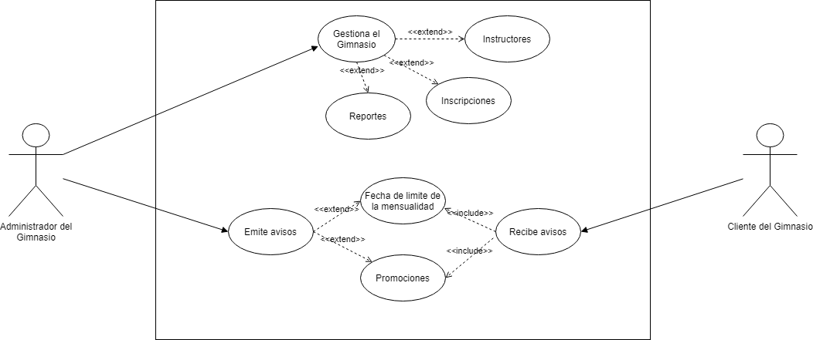
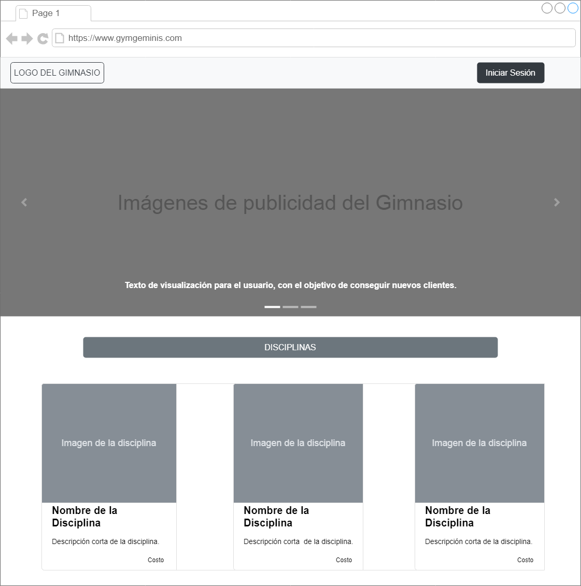
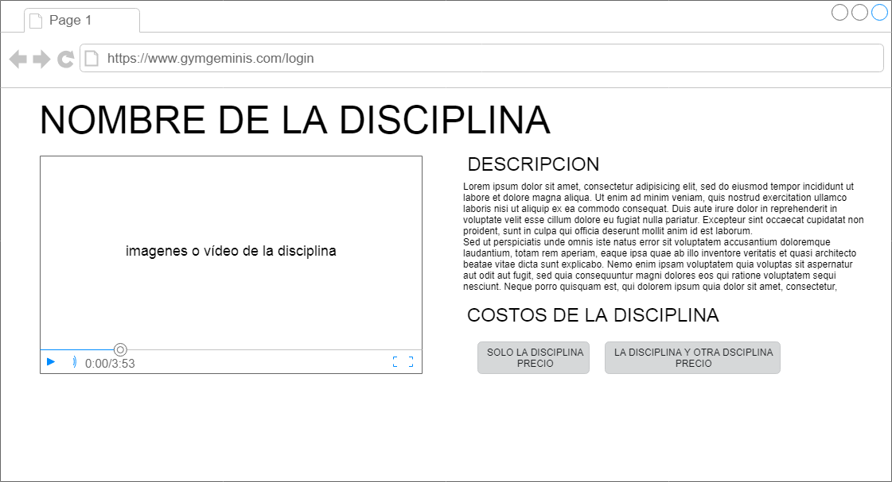

# Proyecto Generador de Reportes y Avisos para un Gimnasio
## Introducción
El gimnasio “Geminis” actualmente tiene dos sucursales en la ciudad de La Paz, una está ubicada en la zona central en la calle Murillo y la otra esta ubicada en la zona de San Pedro en la calle Héroes del Acre.
Anteriormente el gimnasio contaba solo con una sucursal y le resultaba regularmente sencillo el mantener el control de sus registros, avisos y reportes. La segunda sucursal fue inaugurada hace un poco más de un año y el control de todas esas funciones y manejo de información se complicó poco a poco ya que se maneja mayor cantidad de información y se necesitan realizar algunas funcionalidades más, como cruces de información de una manera rápida y efectiva.
El propietario del gimnasio desea abrir una tercera sucursal en la zona de Sopocachi próximamente, es por eso por lo que se ve en la necesidad de contar con un sistema que le permita realizar el control y seguimiento de todas sus sucursales.
## Funcionalidades Principales
Las funcionalidades primordiales que necesita el gimnasio por el momento son las siguientes:
- _	Reporte de las inscripciones de los clientes de manera mensual._
- _	Reporte de salario de los instructores._ 
- _	Aviso a los clientes inscritos cuando su mensualidad esté por vencer 3 días antes._
- _	Aviso a los clientes de las promociones del gimnasio._
## Casos de Uso

## Maqueta del Proyecto
- Página principal

- Página de disciplinas

